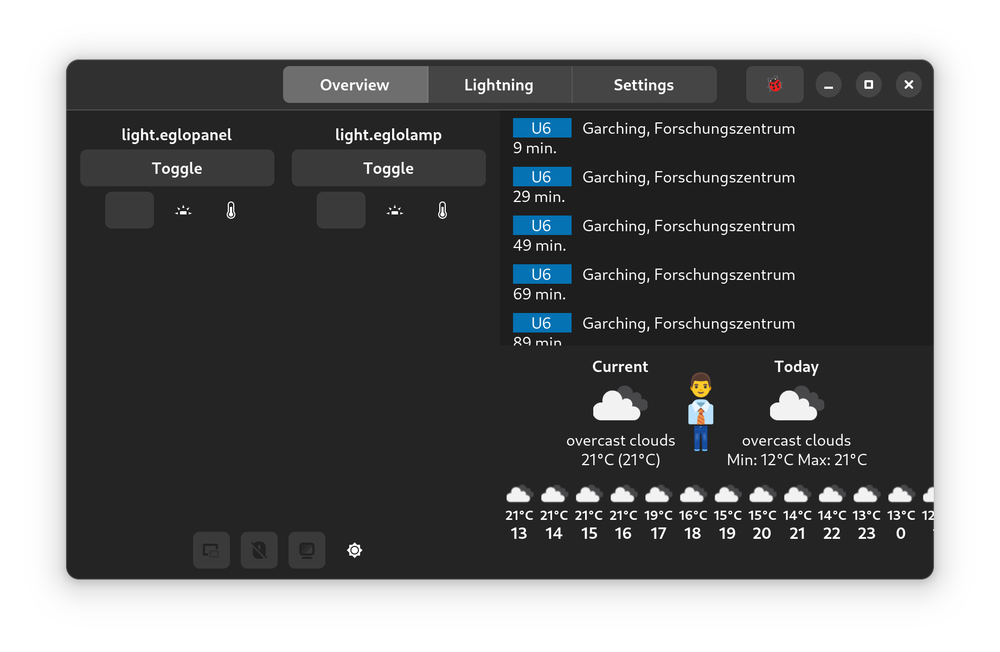

# Home-UI
GTK4 Based UI for home automation using a Raspberry Pi.

## Examples


## Building

### Requirements
#### Fedora
```
sudo dnf install gtkmm4.0-devel libadwaita-devel libcurl-devel g++ clang cmake git
sudo dnf install libsoup3-devel sqlite-devel ninja-build
```

### Building
```
git clone https://github.com/COM8/home-ui.git
cd home-ui
mkdir build
cd build
cmake ..
cmake --build .
```

## Flatpak
The home-ui can be built and installed using Flatpak.

### Requirements
#### Fedora
```
sudo dnf install flatpak flatpak-builder
flatpak remote-add --if-not-exists flathub https://flathub.org/repo/flathub.flatpakrepo
flatpak install flathub org.gnome.Sdk/43 org.gnome.Platform/43
```

#### Debian/Ubuntu
```
sudo apt install flatpak flatpak-builder
flatpak remote-add --if-not-exists flathub https://flathub.org/repo/flathub.flatpakrepo
flatpak install flathub org.gnome.Sdk/43 org.gnome.Platform/43
```

### Building
Add `--jobs=1` to the `flatpak-builder` command when building on a Raspberry Pi to prevent running out of RAM.
```
git clone https://github.com/COM8/home-ui.git
cd home-ui
flatpak-builder --force-clean flatpak_build_dir de.home_ui.cli.yml
```

### Installing
```
flatpak-builder --user --install --force-clean flatpak_build_dir de.home_ui.cli.yml
```

### Cross-Compiling
In case you would like to cross-compile for the Raspberry Pi (aarch64), this can be done as follows:
```
sudo dnf install qemu-system-arm qemu-user-static
sudo systemctl restart systemd-binfmt.service

flatpak install flathub org.gnome.Sdk/aarch64/42 org.gnome.Platform/aarch64/42
flatpak-builder --arch=aarch64 --repo=repo --force-clean flatpak_build_dir de.home_ui.cli.yml
flatpak build-bundle --arch=aarch64 ./repo/ de.home_ui.cli.flatpak de.home_ui.cli

# Copy the "repo" dir to the target system
flatpak --user remote-add --no-gpg-verify home-ui-repo repo
flatpak --user install home-ui-repo de.home_ui.cli
```

### Uninstalling
```
flatpak uninstall de.home_ui.cli
```

### Executing
```
flatpak run de.home_ui.cli
```
